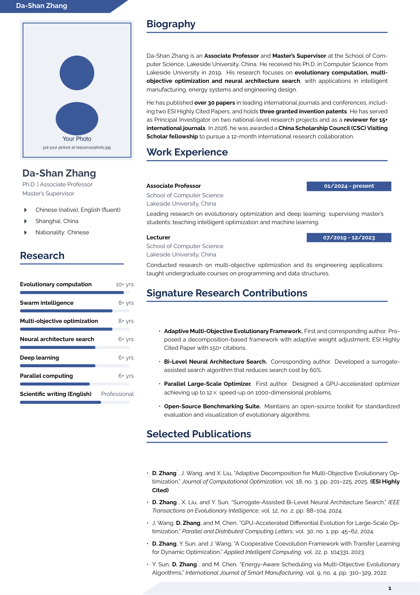
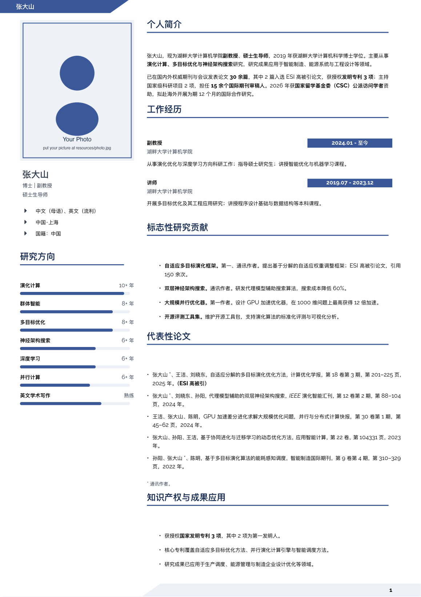
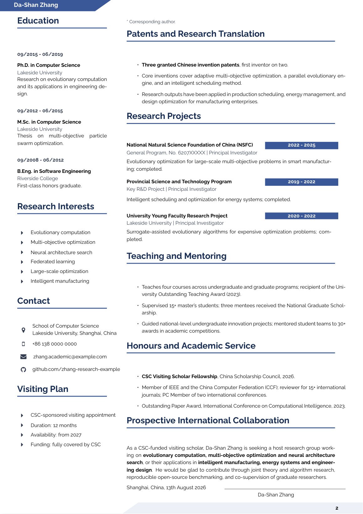
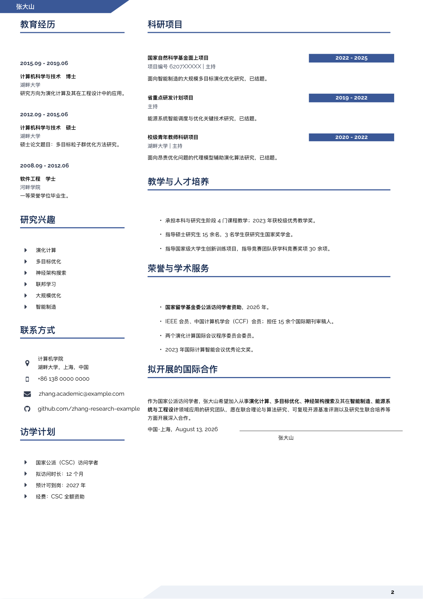
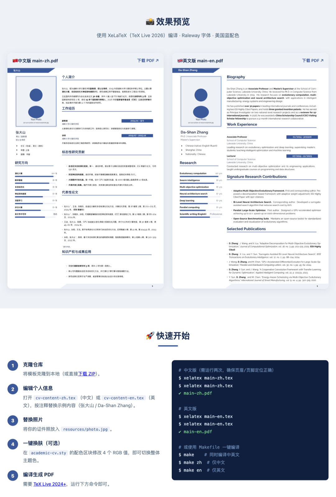

<div align="center">

# 🎓 Visiting Scholar CV Template (LaTeX)

### 访问学者简历模板 · Academic Curriculum Vitae in English & Chinese

A professional, two-column **academic CV template** built with XeLaTeX for **visiting scholars, faculty and graduate researchers** — especially those applying for a **China Scholarship Council (CSC) visiting-scholar appointment**.

[](https://github.com/tsingke/visiting-scholar-cv-template)
[](https://github.com/tsingke/visiting-scholar-cv-template/forks)
[](LICENSE)
[](main-en.tex)
[](https://tug.org/texlive/)
[](README.md)
[](README.md)
[](https://github.com/tsingke/visiting-scholar-cv-template/pulls)
[](https://tsingke.github.io/visiting-scholar-cv-template/)

</div>

---

## ✨ Features

| | |
|---|---|
| 🌏 **Bilingual** | English edition (`main-en.tex`) and Chinese edition (`main-zh.tex`) share one style file |
| 📐 **Two-column layout** | Sidebar (photo, name, skills, education, interests, contact, visiting plan) + main column (biography, experience, publications, projects, teaching, honours, collaboration) |
| 🎨 **One-click re-theming** | Global color palette — change 4 RGB values in `academic-cv.sty` to restyle the entire CV |
| 📊 **Progress-bar skills** | Visual skill level indicators with full-width bars |
| 🧩 **Modular architecture** | Style (`.sty`), entry (`.tex`), and content (`.tex`) strictly separated — edit only the content file for personal info |
| 🔗 **Icon links** | Font Awesome icons with clickable email / GitHub / phone links |
| 🖼 **Fictitious sample** | All sample data (name, affiliation, email, publications) is invented — no private information |
| 🛠 **Build automation** | `latexmk` & `Makefile` support, one command to build |

## 📸 Preview

Compiled with XeLaTeX (TeX Live 2026), Raleway typeface, American-blue palette.

| English edition (`main-en.pdf`) | Chinese edition (`main-zh.pdf`) |
|:---:|:---:|
|  |  |
| *Page 1 — profile, experience, contributions, publications* | *第 1 页 — 个人简介、工作经历、贡献与论文* |
|  |  |
| *Page 2 — projects, teaching, honours, collaboration* | *第 2 页 — 项目、教学、荣誉与合作意向* |

### 🌐 Online Landing Page

A Chinese introduction website is hosted on **GitHub Pages** — a mobile-friendly landing page with features, previews, build instructions and file structure:

**[tsingke.github.io/visiting-scholar-cv-template](https://tsingke.github.io/visiting-scholar-cv-template/)** 📱✨

| Landing page (top) |
|:---:|
|  |

## 🚀 Quick Start

### Requirements

| Component | Note |
|---|---|
| TeX Live 2024+ | with `xelatex`, `latexmk` |
| Raleway fonts | bundled with TeX Live (`fonts/opentype/impallari/raleway`) |
| Font Awesome | bundled with TeX Live (`fonts/opentype/public/fontawesome`) |
| CJK font | `PingFang SC` (macOS) or `FandolHei` (TeX Live, auto-fallback) |

### Build

```bash
# --- English edition (run TWICE so the header/footer anchors are placed correctly)
xelatex main-en.tex
xelatex main-en.tex

# --- Chinese edition
xelatex main-zh.tex
xelatex main-zh.tex

# --- or simply
make            # build both
make en         # english only
make zh         # chinese only
```

Output: `main-en.pdf` and `main-zh.pdf` (2 pages each).

## 📂 File Structure

```
visiting-scholar-cv-template/
├── academic-cv.sty       # style layer: fonts, colors, layout, CV commands
├── main-en.tex           # English entry file (with compile instructions)
├── main-zh.tex           # Chinese entry file (with compile instructions)
├── cv-content-en.tex     # English content layer (sample: Prof. Zhang Dashan)
├── cv-content-zh.tex     # Chinese content layer (sample: 张大山)
├── resources/
│   └── photo.jpg         # placeholder photo — replace with yours
├── docs/preview/         # rendered preview images (this README)
├── Makefile              # one-command build (en / zh / all / clean)
├── latexmkrc             # latexmk configuration for XeLaTeX
├── LICENSE               # MIT license
└── README.md / README-zh.md
```

## 🎨 Customization

### 1 · Personal content — `cv-content-en.tex` / `cv-content-zh.tex`

Everything personal lives in one of these two files. Every section is marked with a comment:

```latex
%--- name and title --------------------------------------------------%
\fcolorbox{white}{white}{\begin{minipage}[c][2.0cm][c]{1\mpwidth}
    \LARGE{\textbf{\textcolor{maincol}{Da-Shan Zhang}}} \\[2pt]
    \normalsize{ \textcolor{maincol} {Ph.D. | Associate Professor} } \\[1pt]
    \normalsize{ \textcolor{maincol} {Master's Supervisor} }
\end{minipage}} \\
```

Replace the fictitious sample (张大山 / Da-Shan Zhang) with your own information.

### 2 · Color theme — `academic-cv.sty`

The whole CV is themed by **four base colors** in the `GLOBAL COLOR PALETTE` block:

```latex
\definecolor{maincol}{RGB}{52,62,80}     % body text
\definecolor{darkcol}{RGB}{24,44,82}     % section headings
\definecolor{accentcol}{RGB}{59,89,152}  % header band, date boxes, bars (American blue)
\definecolor{lightcol}{RGB}{238,242,247} % footer band, bar tracks
```

Swap in any palette — e.g. Harvard crimson `(165,28,48)`, Oxford dark blue `(0,33,71)`.

### 3 · Fonts — `academic-cv.sty`

Fonts are loaded **by file name** (no font-index configuration needed):

```latex
\setmainfont{Raleway-Regular.otf}[
  BoldFont=Raleway-Bold.otf,
  ItalicFont=Raleway-RegularItalic.otf,
  BoldItalicFont=Raleway-BoldItalic.otf
]
```

Chinese fonts are auto-selected: `PingFang SC` on macOS, `FandolHei` elsewhere. Swap in any OpenType font (TeX Gyre Heros, Source Sans Pro, …) the same way.

### 4 · Header name — content files

The name in the top band of every page is set per language:

```latex
\renewcommand{\cvheadername}{Da-Shan Zhang}   % English
\renewcommand{\cvheadername}{张大山}          % Chinese
```

### 5 · Icons — `academic-cv.sty`

Font Awesome v4 icons are mapped by Unicode codepoint:

```latex
\newcommand{\faGithub}{{\iconfont\char"F09B}}
```

Add more icons from the [FA 4.7 cheatsheet](https://fontawesome.com/v4/cheatsheet/) by adding the codepoint.

## 🤝 Contributing

Contributions are welcome!

- 🐛 Found a bug? Open an [issue](https://github.com/tsingke/visiting-scholar-cv-template/issues).
- 💡 Have an idea? Submit a [pull request](https://github.com/tsingke/visiting-scholar-cv-template/pulls).
- ⭐ Like the template? Give it a star — it helps the project grow.

## 📜 License

Distributed under the **MIT License**. See [LICENSE](LICENSE) for more information.

*Inspired by the two-column CV design of Philip Empl (MIT).*

---

<div align="center">
Made with ❤️ for the global academic community · 愿所有访问学者申请顺利 🚀
</div>
